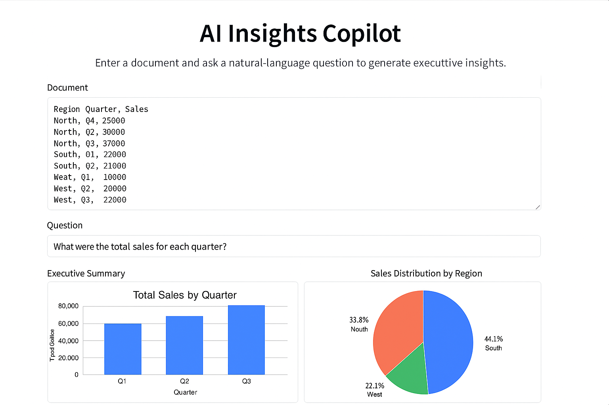
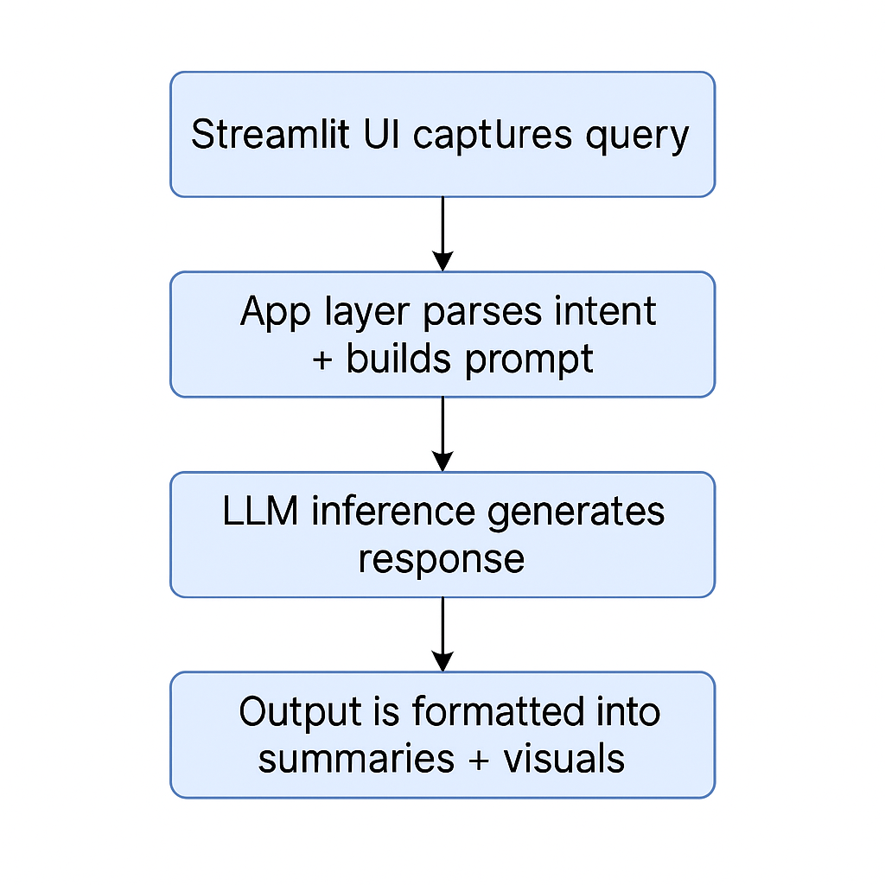

# AI-Insights-Copilot
Generative AI dashboard built with Python 3.13 and Streamlit
# AI Insights Copilot
**Generative AI Dashboard & Intelligent Query Engine**  
Streamlit + Python 3.13 + LLM inference to turn recruiter-style questions into structured, actionable insights.

<p align="center">
  
  
</p>
  <!-- Replace with your real links -->


---

## Overview
AI Insights Copilot is a Streamlit-based Generative AI assistant that converts natural-language questions into:
- **Structured summaries**
- **Key takeaways**
- **Tables / analytics**
- **Visualization-ready outputs**

It’s designed as an enterprise-ready prototype: modular app architecture, secure configuration via environment variables, and a clear path to cloud deployment.

---

## Demo
> Add a short GIF or screenshot here (recommended).

## Demo




---

## Key Features
- **Natural-language query input** → insight generation
- **Prompting + routing** to shape outputs based on intent
- **LLM API integration** (secure via `.env`)
- **Dashboard UX** built for recruiter/business workflows
- **Extensible data layer** (CSV/JSON now; SQL/APIs/RAG later)

---

## Architecture




**High-level flow**
1. Streamlit UI captures query  
2. App layer parses intent + builds prompt  
3. LLM inference generates response  
4. Output is formatted into summaries + visuals

---

## Tech Stack
- **Python 3.13**
- **Streamlit**
- **LLM API** (OpenAI / Gemini / etc. — pluggable)
- **Pandas** for data shaping
- **Matplotlib/Plotly** (optional) for charts

---

## Getting Started

### 1) Clone the repo
```bash
git clone https://github.com/YOUR_GITHUB_USERNAME/ai-insights-copilot.git
cd ai-insights-copilot

